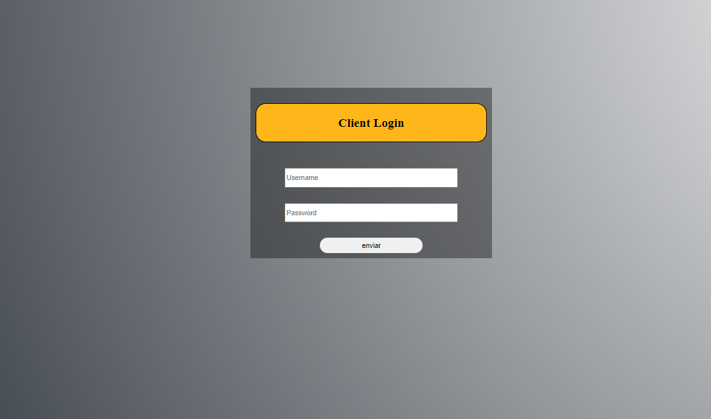

# Nomenclatura de BEM y SUITCSS

## BEM (Block Element Modifier)

BEM es una metodología de desarrollo web que se centra en la modularidad y reutilización del código CSS. Utiliza una convención de nomenclatura clara y estructurada que divide los estilos en bloques, elementos y modificadores.

Ejemplo en HTML:

```html

<div class="block">
    
    <p class="block__paragraph"><p>
    <button class="button button--large">Enviar</button>
</div>

```

## SUITCSS

SUITCSS es otra metología de desarrollo web que se basa en la creación de estilos modulares y reutilizables. También utiliza una convención de nomenclatura clara pero se enfoca en componentes más que en bloques,elementos y modificadores.

Ejemplo en HTML:

```html

<div class="Component">
        
        <p class="Component-paragraph"></p>
        <button class="button button--boton">Enviar</button>
    </div>

```

# SMACSS

SMACSS, que significa "Scalable and Modular Architecture for CSS" (Arquitectura Escalable y Modular para CSS), es una metodología para organizar y estructurar hojas de estilo en proyectos web. Fue desarrollada por Jonathan Snook y se centra en crear CSS modular, reutilizable y fácil de mantener.

1.**Base**:Define los estilos base para elementos HTML sin clases,como body,h1, a, etc. Estos estilos establecen la base para el resto del diseño.

2.**Layout**: Divide la página en secciones de diseño,como encabezado,barra lateral,contenido principal,pie de página,etc. Los estilos de diseño controlan la disposición general de estos elementos.

3.**Module**: Los módulos son componentes independientes y reutilizables de la interfaz de usuario,como botones,formularios,carruseles, etc. Cada módulo debe ser autónomo y no depender de otros estilos para funcionar correctamente.

4.**State**: Los estados representan las diferentes interacciones o estados en los que puede estar un módulo,como :hover,etc. Los estilos de estado se utilizan para cambiar la apariencia de un módulo en función de su estado actual.

5.**Theme**: Los temas definen los estilos visuales que se pueden cambiar fácilmente para adaptarse a diferentes diseños o marcas. Esto incluye variables de color,fuentes,tamaños de texto,etc.

# Funcionamiento de mi proyecto

En mi proyecto, utilicé la nomenclatura SUITCSS y la arquitectura SMACSS para organizar y estructurar los estilos de mi página web.

```html
    <form>
        <section class="Container">
            <div class="Container-items">
                <h1>Client Login</h1>
                <input type="text" placeholder="Username">
                <input type="password" placeholder="Password">
                <button><a href="/index2.html">enviar</a></button>
            </div>
        </section>
    </form>
```

Aquí es donde implementé mi metodología SMACSS para organizar y estructurar los estilos de mi proyecto. Utilicé las diferentes categorías de SMACSS, como Base, Layout, Module, State y Theme, para gestionar de manera efectiva la arquitectura CSS de mi sitio web.

```css

/*_base.scss*/

body{
    background-image: radial-gradient(circle at top right, white,#1b222b);
    background-size: cover;
    background-repeat: no-repeat;
    background-attachment: fixed;
    
    margin: 0;
    padding: 0;
}

/*layout.scss*/

.Container{
    display: flex;
    justify-content: center;
    align-items: center;
    flex-direction: column;
    position: absolute;
    top: 25%;
    left: 40%;

    &-items{
        display: grid;
        padding: 10px;
    }
}

/*module*/

input{
    margin: 0 auto;
    margin-top: 30px;
    padding: 3px;
    width: 330px;
    height: 30px;
}

button{
    margin: 0 auto;
    margin-top: 30px;
    width: 200px;
    height: 30px;
}

/*theme*/

$First-color: #ffb61a;

h1{
    text-align: center;
    border: 1px solid black;
    border-radius: 20px;
    background-color: $First-color;
    padding: 23px;
}

.Container-items{
    width: 450px;
    background-color: rgba(0, 0, 0, 0.37);
}

button{
    border: none;
    border-radius: 20px;
}

a{
    text-decoration: none;
    color: black;
}

```


En mi index.html representa un formulario de inicio de sesión para clientes donde utilize la nomenclatura SUITCSS y la arquitectura SMACSS.



como este proyecto era solo utilizar HTML con las nomenclatura de SUITCSS y CSS con el preprocesador de SASS use un enlace dentro de mi boton. Al hacer clic en el boton,el usuario sera dirigido a la pagina **index2.html**.

Luego cree un nuevo archivo HTML donde representa una barra de navegación que contiene 4 enlaces,Inicio,Trabajo,Sobre mi,Cerrar sesion. La barra de navegacion suelen estar organizados horizontal y algunas veces vertical.

```html
    <nav class="Nav">
        <ul class="Nav-list">
            <li class="Nav-item"><a href="" class="Nav-page">Inicio</a></li>
            <li class="Nav-item"><a href="" class="Nav-page Nav-page--active">Trabajos</a></li>
            <li class="Nav-item"><a href="index3.html" class="Nav-page">Sobre mi</a></li>
            <li class="Nav-item"><a href="index.html" class="Nav-page">Cerrar Sesion</a></li>
            </ul>
    </nav>
```

Por último, aquí es donde implementé mi metodología SMACSS para organizar y estructurar los estilos de mi index2.html. Utilicé solo 2 categorías de SMACSS, layout y theme.

```css

.Nav{
    border: 1px solid;
    margin: 20px;
    padding: 20px;

    &-list{
        list-style: none;
        display: flex;
        justify-content: space-around;
    }
}

$background-help: #787878;

$background-nav: #5c5c5c96;

.Nav{
    background-color: $background-nav;
    border-radius: 20px;
}

.Nav-page{
    text-decoration: none;
    color: black;
    font-size: 30px;

    &--active{
        background-color: $background-help;
        box-shadow: 2px 4px 3px 2px;
        border-radius: 20px;
        padding: 10px;
    }
}

```


